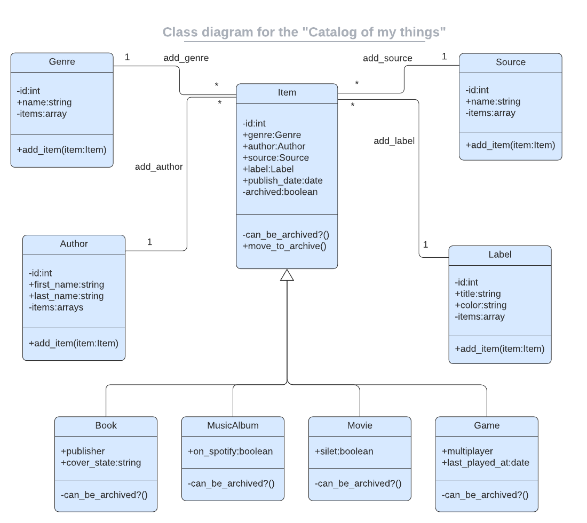

# Project Name: Ruby-project-Catalog-of-my-things

## Project description:
A console app that help to keep a record of different types of things you own: books, music albums, and games

The app allow to:

- List all books
- List all music albums
- List all movies
- List of games
- List all genres (e.g 'Comedy', 'Thriller')
- List all labels (e.g. 'Gift', 'New')
- List all authors (e.g. 'Stephen King')
- List all sources (e.g. 'From a friend', 'Online shop')
- Add a book
- Add a music album
- Add a movie
- Add a game

All data is preserved by saving collections in .json files.

## Project Requirements:
Create the entities presented in this diagram:

-Database
The schema.sql file: it has tables analogical to the structure of the app classes. Properties and associations from the parent Item class are added as table columns to all tables based on the child classes.

## Getting Started

Get a local copy by clonning this repo.

To run the code please use the "Code Runner" VSCode extension or
ruby main.rb in the terminal.

## Built With:
Major languages: Ruby, Postgresql
Technologies used: VSC, Github, Gitflow, RSpec

##  Authors
👤 Author1

Dario Alessio

GitHub: https://github.com/DarioAlessioR

Slack: https://microverse-students.slack.com/team/U039GCFRK9B

LinkedIn: https://www.linkedin.com/in/dario-alessio-3a3b7911b

## 🤝 Contributing:

Contributions, issues, and feature requests are welcome!

Feel free to check the [issues page](../../issues/).

## Show your support:

Give a ⭐️ if you like this project!

## Acknowledgments

- Hat tip to anyone whose code was used
- Inspiration
- etc

## 📝 License

This project is [MIT](./LICENSE.md) licensed.